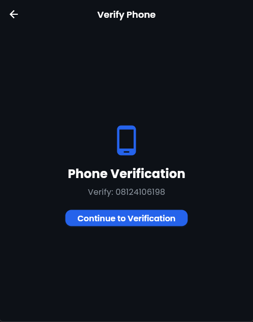
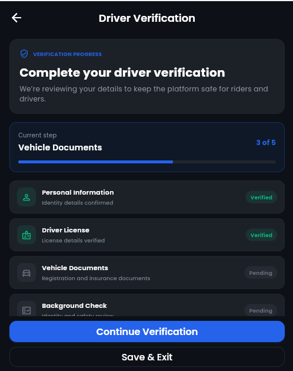
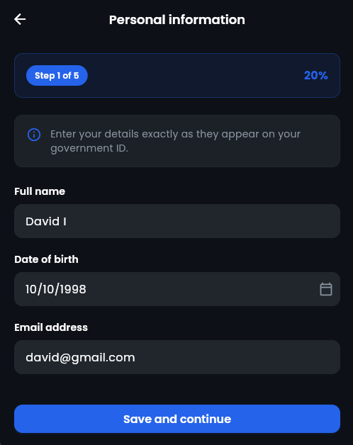
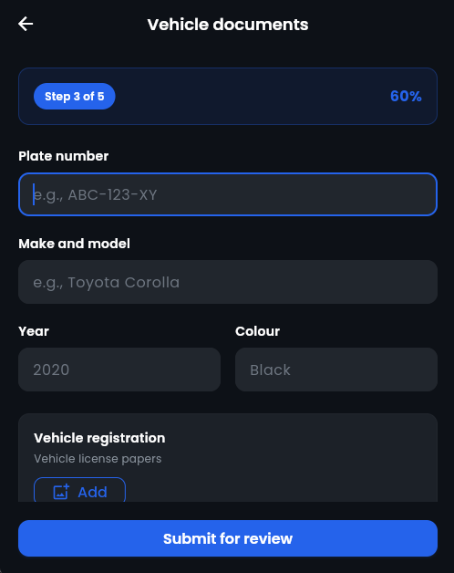
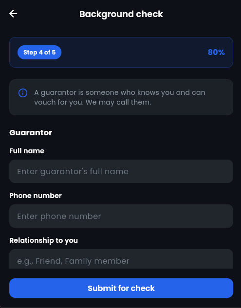
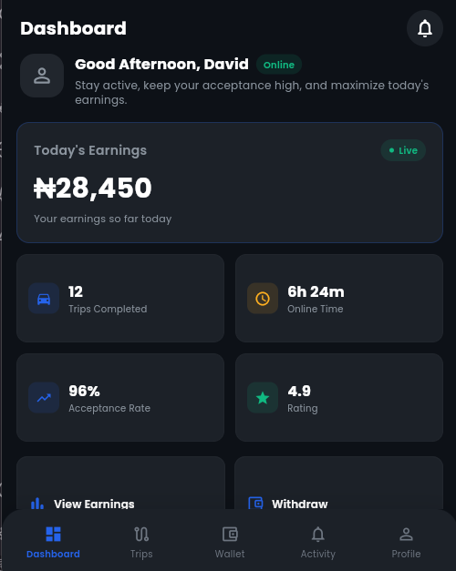
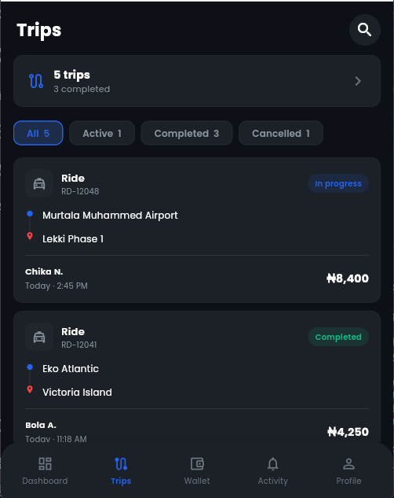
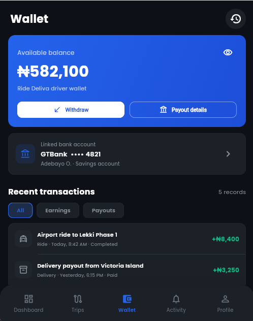
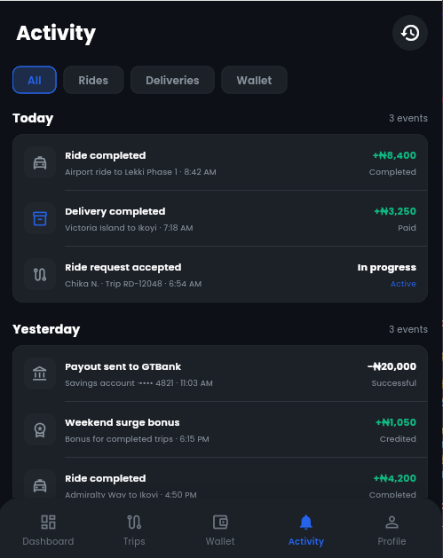
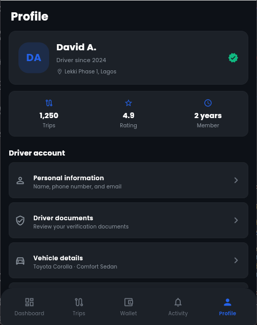

# Ride Deliva Driver

**A professional driver app for the Ride Deliva platform** - enabling drivers and Riders to accept rides, manage earnings, and track performance in real-time.

## 📱 Screenshots

### Onboarding & Authentication
<div style="display: flex; gap: 10px;">

| Onboarding | Driver Login | Phone Verification |
|------------|--------------|-------------------|
|  |  |  |
| Drive & earn with flexibility | Sign in with phone number | Secure phone verification |

</div>

### Document Verification Flow
<div style="display: flex; gap: 10px;">

| Verification Overview |  | Background Check |
|----------------------|---------------------|------------------|
|  |  |  |
| 4-stage verification process | | Guarantor & emergency contact |

</div>

### Main Dashboard
<div style="display: flex; gap: 10px;">

| Dashboard | Trips | Wallet |
|-----------|-------|--------|
|  |  |  |
| Live earnings & performance | Trip history & management | Balance & transactions |

</div>

### Additional Screens
<div style="display: flex; gap: 10px;">

| Activity | Profile |
|----------|---------|
|  |  |
| Recent activities & events | Driver profile & settings |

</div>

---

## 🚀 Getting Started

### Prerequisites
- Flutter SDK 3.16+
- Dart 3.2+
- Android Studio / VS Code
- Android device or emulator (for full feature testing)

---

## ✨ Key Features

### 🔐 Complete Verification System
- **4-Stage Document Upload Flow**
  - Step 1: Personal Information (Name, DOB, Email, NIN, Selfie)
  - Step 2: Driver License (Front/Back photos, License details)
  - Step 3: Vehicle Documents (Registration, Insurance, Photos)
  - Step 4: Background Check (Guarantor, Emergency contact)
- Real-time verification status tracking
- Secure document upload with validation

### 📊 Dashboard & Analytics
- Live earnings display with daily totals
- Performance metrics (trips, rating, online time)
- Quick action buttons for key features
- Status management (Online/Offline toggle)

### 🚗 Trip Management
- Active trip tracking
- Trip history with filter options
- Earnings per trip
- Customer ratings and feedback

### 💰 Wallet & Earnings
- Real-time balance updates
- Transaction history (earnings and payouts)
- Linked bank account management
- Withdrawal functionality

### 📱 Activity Tracking
- Recent events timeline
- Ride completions and deliveries
- Payout notifications
- Bonus and rewards tracking

---

## 🏗️ Architecture

This app follows **Clean Architecture** principles with BLoC state management:

```
lib/
├── core/                 # Shared utilities and configurations
│   ├── constants/       # App constants
│   ├── theme/          # UI theme and styling
│   └── utils/          # Helper utilities
├── data/               # Data layer (to be implemented)
│   ├── models/         # Data models
│   ├── repositories/   # Repository implementations
│   └── providers/      # API and local storage
├── presentation/       # Presentation layer
│   ├── screens/        # UI screens
│   └── widgets/        # Reusable widgets
└── main.dart          # App entry point
```

---

## 📂 Project Structure

```
driver_app/
├── lib/
│   ├── core/
│   │   ├── constants/app_constants.dart
│   │   └── theme/
│   │       ├── app_theme.dart
│   │       └── app_colors.dart
│   ├── presentation/
│   │   └── screens/
│   │       ├── splash/
│   │       ├── onboarding/
│   │       ├── auth/
│   │       ├── dashboard/
│   │       ├── trips/
│   │       ├── wallet/
│   │       ├── activity/
│   │       ├── profile/
│   │       └── document_verification/
│   │           └── rider/          # 4-stage verification flow
│   └── main.dart
├── assets/
│   ├── images/
│   ├── icons/
│   └── fonts/
├── test/
├── docs/
│   └── screenshots/                # App screenshots
├── pubspec.yaml
├── progress.md                     # Development progress tracker
└── README.md
```


---

## 🔄 Development Progress

See [progress.md](progress.md) for detailed development timeline and updates.


---

## 🤝 Contributing

This is a private project for Ride Deliva. For questions or issues, contact the development team.

---

## 📄 License

Proprietary - All rights reserved by Ride Deliva

---


---

**Built with Flutter 

